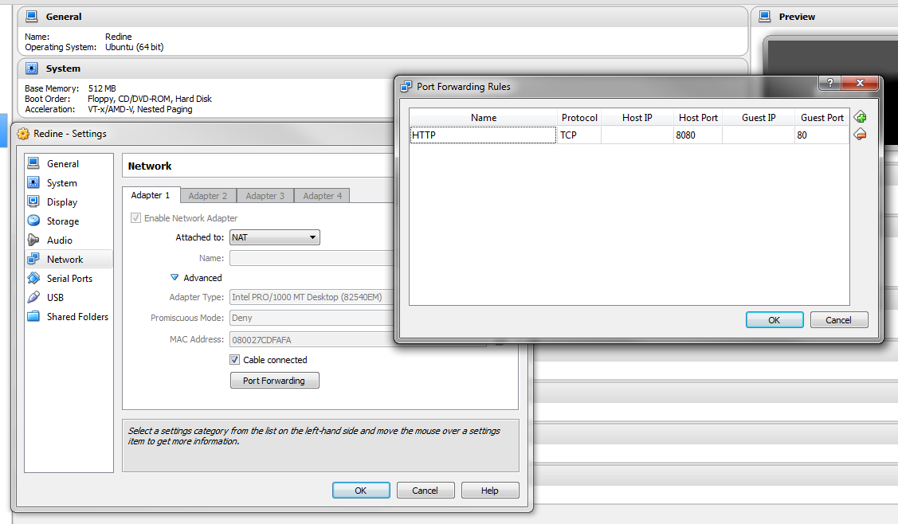
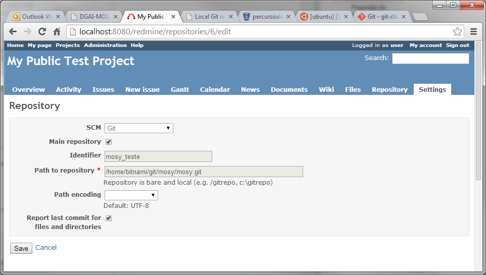

Redmine instalation
###################

Preamble
********

Presently, the `BitNami Redmine Stack`_ virtual machine (VM) is being used.
The following notes thus apply to the deployment of this VM using `Oracle VirtualBox`_,
and not specifically to a `Redmine step-by-step installation`_ <http://www.redmine.org/projects/redmine/wiki/RedmineInstall>`_.

The notes below are applicable to a test environment (e.g. in a personal computer)
and are not necessarily adequate or recommended
for deployment in a production environment.

Note also that the Bitnami Redmine Stack ships with MySql_ as a database back-end.

Detailed information can be found at http://wiki.bitnami.com/Applications/BitNami_Redmine.

Deployment
**********

1. Update `Oracle VirtualBox`_ if necessary.
   Install the most recent `VirtualBox Extension Pack`_.

#. Download the VM from http://bitnami.com/stack/limesurvey.
   Unzip...

#. Create a new VirtualBox VM

   *  Guest OS: Ubuntu 64-bit
   *  RAM: at least 512 MB RAM
   *  Storage: select the VMDK file
   *  Network: Enable NAT

   After everything is configured,
   the network adapter will be changed to Bridged Adaptor
   (had some problems with the Bridged Adaptor over WiFi, hence this choice).

   NAT can also be used if the Guest is to be accessed only from the Host.
   Port forwarding was setup as depicted below:

   
#. Start the VM.
   Prepare to install the Virtual Box Guest Additions
   (Devices --> Install Guest Additions)

#. The default Linux login is ``bitnami/bitnami``.
   In real life, the default users and passwords should be changed.

#. Enable root::

   $  sudo passwd root
   
   In real life, the ``root`` password should **not** be enabled.
   (Instead of entering as root, use ``sudo`` instead).
   
#. Change keyboard layout if required::

   $  sudo apt-get update
   $  sudo apt-get install console-data
   $  sudo dpkg-reconfigure keyboard-configuration
   $  sudo dpkg-reconfigure console-setup
   
   If later reconfiguration is required::
   
   $  sudo dpkg-reconfigure console-data

#. Install the VirtualBox Guest Additions::

   $  sudo mount /dev/cdrom /mnt
   $  cd /mnt
   $  sudo ./VBoxLinuxAdditions.run
   $  sudo reboot

   If the build fails, check the log file::

   $ nano /var/log/vboxadd-install.log
 
   (Note that there is always be a fail message for windows system 
   if no graphic interface is installed in the server)::
   
   $  sudo apt-get update
   $  sudo apt-get install dkms              #if required
   $  sudo apt-get install build-essential   #if required
   $  sudo apt-get linux-headers-generic     # and/or 
   $  sudo apt-get linux-headers-3.2.0-53-virtual # for example, if such is the version required...

#. How to access the BitNami Virtual Appliance?

If the network as been set to NAT and port forwarding has been configured as specified above,
then the application can be accessed at http://localhost:8080/redmine .

The default application login information is ``user/bitnami``

Further information is available here: http://bitnami.com/faq/virtual_machines

Backups
*******

Redmine backups should include:

*  data (stored in your redmine database)
*  attachments (stored in the files directory of your Redmine install)

Here is a simple shell script that can be used for daily backups (assuming you're using a mysql database)::

   # Database
   /usr/bin/mysqldump -u <username> -p<password> <redmine_database> | gzip > /path/to/backup/db/redmine_`date +%y_%m_%d`.gz
   
   # Attachments
   rsync -a /path/to/redmine/files /path/to/backup/files
   
Repositories
************

The Bitnami Redmine Stack already includes Git.

Access to a local git repository can be configured by the project's manager
at the project settings tab.

.. image:: img/Redmine_RepositoryTab.png

Note that the repository should be local and bare.
For example, to clone from a remote repository, use::

   git clone --bare git://yourgitserver.org/project.git
   
and add full path to the repository in Projects > Settings > Repositories
e.g. ``/var/repositories/project.git``.

Permissions on the repository folder for the redmine user:group should be are 775.

To update the bare repository with changes from its remote working origin do::

   git fetch -q origin master:master
   
or push the changes into the bare repository::

   git push --all <url-of-bare-repo>
   
.. note:: See

   http://www.redmine.org/boards/2/topics/34226?r=35533
   http://www.saintsjd.com/2011/01/what-is-a-bare-git-repository/

.. links-placeholder

.. include:: ../Z_SharedFiles/Z_GenericLinks.txt

.. _Bitnami Redmine Stack: http://bitnami.com/stack/redmine
.. _Oracle VirtualBox: https://www.virtualbox.org/
.. _VirtualBox Extension Pack: https://www.virtualbox.org/wiki/Downloads
.. _Redmine step-by-step installation: http://www.redmine.org/projects/redmine/wiki/RedmineInstall