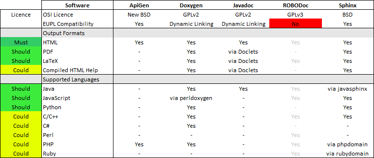

.. metadata-placeholder

:DC.Title:
	Selection of the Documentation Generator
:DC.Creator:
	Nery, Fernanda
:DC.Date:
	2013-05-20
:DC.Description:
   Information on the selection of the documentation.
   Based on previous R&D projects.
:DC.Language:
	en
:DC.Format:
	text/x-rst
:DC.Rights:
	Access restricted to project members.
:DC.RightsHolder:
   Fernanda Nery 2009-2013 © CC BY-SA 3.0 http://creativecommons.org/licenses/by-sa/3.0/

.. _sw-documentiongenerators-ref:

Documentation Generator
***********************

Requirements
============

The selected documentation tool is Sphinx_.

If strictly required,
developer documentation may be generated from source code using Doxygen_.

If required for dissemination purposes,
file conversion into common open and proprietary formats
can be accomplished with Pandoc_.

ReadTheDocs_ (either through the online service or using a local deployment)
can be used for automated documentation generation using Sphinx_ and
reStructuredText_ documentation stored in a Git_ repository.

Rationale
=========

The main objective is to find a tool adequate for user documentation, that:

*  Is easy to work with, by non-technical writers
*	Can support the translation process (from EN to PT, CY, BG, etc.)
*	Can generate outputs in different formats (HTML, PDF)
*	Can produce print quality documents, using different stylesheets
*  Can also support the creation of developer documentation from source code
   (e.g. API documentation).

All documentation must be kept under version control:
differences or changes between versions must be readily identifiable.
(For example, if the English version of a user manual is updated,
changes are required in the localised versions,
in the specific files, paragraphs or lines that changed).

Fast identification of changes and differences
is a built-in feature of the :ref:`version control system <sw-vcs-ref>`
if the documentation is stored in plain text files.
This excludes the use of binary formats, such as Microsoft Word documents (DOC_),
or zipped XML formats, such as ISO/IEC 26300:2006 OpenDocument (ODT_)
or Microsoft Office Open XML (DOCX_).
(Conversion tools from and to these formats must nevertheless be available).

By using plain text files, the documentation content can be produced using a simple text editor
(i.e. does not require dedicated tools such as word processors or desktop publishing tools).
However, a long or steep learning curve should be avoided,
which excludes markup languages such as DocBook_ or LaTeX_,
that are overly complex.

A `lightweight markup language`_
(such as Markdown_, `reStructuredText`_ or `Wiki Markup`_) is thus required:
"*simple syntax,
designed to be easy for a human to enter with a simple text editor,
and easy to read in its raw form*".

Other basic feature requirements are:

*  separation of content (structured text) and presentation (formatting styles),
*  support for style sheet languages such as Cascading Style Sheets (CSS)
   and/or the Extensible Stylesheet Language (XSL),
*  support for HTML/XML templating engines
   in the automated documentation build processes,
   and LaTeX templates for printed documentation
   (as a common intermediate step for generating print-quality PDF output).

Analysis of alternatives
========================

The following table contains a comparison of 5 documentation generators:

*  ApiGen_
*  Doxygen_
*  Javadoc_
*  ROBODoc_
*  and Sphinx_

.. _sw-documentiongenerators-table-ref:

.. rubric:: Evaluation:

*  Support for specific programming languages
   -- i.e technical documentation automatically generated from source code --
   is shown in the results table above.

*  For mere syntax highlighting, Sphinx uses the Pygments_ library
   (under BSD licence)
   that supports all the listed programming languages.

*	ROBODoc was excluded on the basis of :ref:`licence compatibility <sw-constraints-ref>`.

*	ROBOdoc and Javadoc are not under active development -- see ohloh_.

*  Javadoc is typically used for Java code documentation
   and is not not really a general purpose documentation generator.

*	ApiGen and Javadoc are dominated alternatives when compared to Doxygen and Sphinx.

Real-world use
==============

Basic information on developer community activity
is available through the following `Ohloh indicators on documentation tools`_.

Since the only non-dominated alternatives are Doxygen_ and Sphinx_,
software adoption and real-world use cases were only investigated
for these products.

Extensive lists of `projects using Doxygen`_ and `projects using Sphinx`_
are available online.

The following conclusions can be drawn:

*  Doxygen is mainly used for developer documentation,
   such as API documentation, although some open-source projects
   also use it for user documentation (PostgreSQL, PostGIS, GEOS, GDAL).

*  Sphinx is extensively used for user manuals, tutorials and books,
   but can also be used for developer documentation,
   either through direct support or through additional 'language domains',
   such as javasphinx_.

*  Doxygen output can be incorporated in Sphinx documentation,
   via the BREATHE_ extension (under BSD licence).

The following links illustrate the use of Sphinx_ for different (technical) purposes:

*  `Documentation Generators <https://pvbookmarks.readthedocs.org/en/latest/devel/documentation/index.html>`__
   [#rtd]_.

*  `Managing Multilingual Documentation with Sphinx and Transifex <http://techblog.safaribooksonline.com/2013/02/16/managing-multilingual-documentation-with-sphinx-and-transifex/>`_
*  `Documenting Multiple Programming Language APIs with Sphinx <http://techblog.safaribooksonline.com/2013/04/23/documenting-multiple-programming-language-apis-with-sphinx/>`_
*  `Writing Technical Documentation with Sphinx, Paver, and Cog <http://broadcast.oreilly.com/2009/02/writing-technical-documentatio.html>`_
*  `Brandon Rhodes PyCon 2013 Sphinx tutorial source code <https://github.com/brandon-rhodes/sphinx-tutorial>`_

.. rubric:: Conclusions
   
*  Sphinx_ is better for user documentation.

*  The PANDOC_ library (under GPLv2 licence) can be used to
   convert RST_ to a large number of formats (including DOCX_ and ODT_).

*  The javasphinx_ extension to the Sphinx documentation system
   adds support for documenting Java projects.
   It includes a Java domain for writing documentation manually
   and a javasphinx-apidoc utility which will automatically
   generate API documentation from existing Javadoc markup.

*  Doxygen_ can complement Sphinx (for developer documentation
   and programming language not supported by Sphinx).

*  `ReadTheDocs.org`_ is an online hosting service for Sphinx_ documentation.
   The service can be connected to a repository under version control,
   using either Bazaar_, Git_,  Mercurial_ or Subversion_.
   Web hooks are supported (when changes are committed,
   the documentation is automatically rebuilt), also with
   two online repository hosting services, GitHub_ and BitBucket_.
   The ReadTheDocs_ software is available under an MIT licence
   and a local deployment can be used (if required).

.. Rubric:: Footnotes

.. [#rtd]   An overview and list of bookmarks  
   which is itself written in reStructuredText_, build in Sphinx, stored on a 
   BitBucket `repository <https://bitbucket.org/pvergain/devtools_doc>`__ 
   under Mercurial version control and published online using `ReadTheDocs.org`_.

.. links-placeholder

.. include:: ../Z_SharedFiles/Z_GenericLinks.txt

.. _projects using Doxygen: http://www.stack.nl/~dimitri/doxygen/projects.html
.. _projects using Sphinx: http://sphinx-doc.org/examples.html