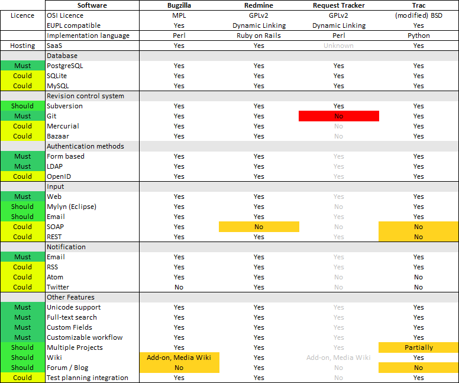
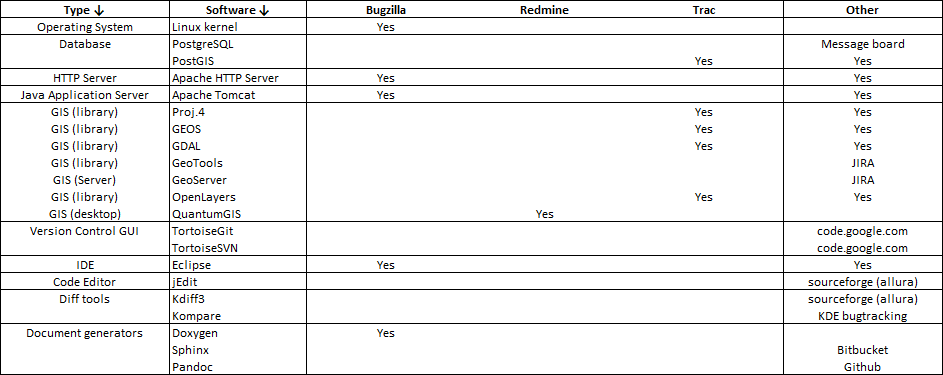

.. metadata-placeholder

:DC.Title:
	Selection of the Project Management and Issue Tracking System
:DC.Creator:
	Nery, Fernanda
:DC.Date:
	2013-05-01
:DC.Description:
   Information on the selection of the Project Management and Issue Tracking System.
   Based on previous R&D projects.
:DC.Language:
	en
:DC.Format:
	text/x-rst
:DC.Rights:
	Access restricted to project members.
:DC.RightsHolder:
   Fernanda Néry 2009-2013 © CC BY-SA 3.0 http://creativecommons.org/licenses/by-sa/3.0/

.. _sw-issuetracking-ref:

Issue Tracking System
*********************

Requirements
============

.. note:: Important note

   This document refers to the outcome of the preliminary software selection process.
   
   Following the procurement process, 
   and based upon the preference expressed by the infrastructure provider 
   and accepted by the development contractor,
   a decision was reached to use Redmine_ instead of Trac_.

The project management and issue tracking system proposed for this project
is Trac_.

Alternatives such as Redmine_ or Bugzilla_ can be adopted,
if required or preferred by the infrastructure provider
or already in use by the development contractor.

Online issue tracking systems,
namely those associated with sourcecode hosting sites
such as github_, bitbucket_ or sourceforge_
are an easily deployable and inexpensive alternative.

Rationale
=========

(See overview in :ref:`sw-technical-infrastructure-ref` )

Generically, an 'issue' is any task that must be accomplished
within a given time frame, has a responsible party/user
and a predefined or an *ad-hoc* workflow.
'Issues' can be software feature requests, bug reports, etc.,
but can also be RFC (Request for Comments) on existing documents,
meeting agendas, etc..

The issue tracking system is the software product
responsible for maintaining a list of (prioritised) open issues
and dispatching them to the responsible parties based
on the selected workflow.

Some issue tracking systems have features similar to project management applications
and can be used for generic project management, in addition to their main role
in supporting the software development process and interactions with end-users.

If the product is to be used also as the project's initial website
and project management tool, then two complementary features are useful:

*  a wiki to allow non-technical (authorised) users
   to add, modify or delete the online content,
   using a `lightweight markup language`_.
*  a forum (message board) to centralise and archive project-related messages
   and discussions (a customised type of 'issue' can be used for this purpose).

Besides the generic :ref:`COTS selection constraints <sw-constraints-ref>`,
two integration requirements apply:

*  Git_ **must** be one of the supported version control system,
   as most tickets/issues will likely refer to or affect documentation
   and source code

*  PostgreSQL_ **should** be one of the supported database back-ends:
   this is not a functional requirement,
   but consolidates the software portfolio
   and allows the reuse of limited DBA and infrastructure resources
   (should in-house hosting be adopted).

A :ref:`puzzle assembly strategy <sw-selection-strategies-ref>`
is also applied to the software dependencies of each product:
if it requires a software component that is also required by another component,
then a smaller software portfolio can be defined
(requiring less training, less administration skills, etc.
and reducing the TCO).

Other features are discussed in the next section.

Analysis of alternatives
========================

The following table contains a comparison of 4 issue tracking products
compatible with the established :ref:`COTS selection constraints <sw-constraints-ref>`:

*  Bugzilla_
*  Redmine_
*  `Request Tracker`_
*  and Trac_

|

.. _sw-issuetracking-table-ref:

.. topic:: Table legend

   .. list-table::
      :widths: 10 90 

      *  -  **Feature**
         -  **Description**
      
      *  -  Implementation language
         -  Indicates the programming language used for product implementation,
            which has implications of the product's software dependencies.
      *  -  Cloud services
         -  Indicates if cloud-based service providers are available, 
            that would allow the product to be used 
            as SaaS_ (Software as as Service). 
            
      *  -  Database:
         -  Lists supported FOSS database back-ends 
            (other proprietary DBMS such as Oracle are also supported)
      *  -  Revision control system
         -  Lists the supported version control systems.
      *  -  Authentication methods
         -  Basic form-based authentication will be required for external users 
            (the various project partners, the development contractor); 
            LDAP for internal users.
      *  -  Input methods
         -  Interactive web-based is required for end-users; 
            e-mail can be useful for the technical team; 
            Mylyn integration can be useful if the development team 
            uses the Eclipse IDE (e.g. for Java development) 
            or simply if the Eclipse Platform 
            is used for project and task management by team members. 
      *  -  Notification methods
         -  E-mail based notification is required, 
            other options may be nice-to-have.
      *  -  Basic features
         -  Unicode support, the possibility to add/customise fields, 
            and full-text searches are basic requirements 
            (that were mainly used exclude software options 
            from the candidate set).               
      *  -  Multiple projects
         -  Support for multiple projects is not required for the project, 
            but allows the reuse of the same platform at organisation level.
      *  -  Wiki
         -  Collaborative editing of project pages is not required 
            for issue tracking, but may be a convenient feature, 
            specially for non-technical documentation (and end-users).
      *  -  Forum / blog
         -  Again, this feature is not required for issue tracking, 
            but can provide a convenient platform for team members and end-users. 
            The forum should be monitored by technical elements, 
            in order to identify potential issues/bugs 
            that should raise a formal issue tracking workflow. 
            Similarly, a blog can be used to provide 
            end-users with (non-technical) feedback 
            on new features, bugs resolved, etc. 

.. rubric:: Evaluation
         
The functional evaluation is not conclusive:
except for RT_, the alternatives meet the established criteria.
[#bugzilla-demo]_ [#redmine-demo]_ [#trac-demo]_

All products require the following components:

*  Database back-end: either PostgreSQL_ or MySQL_
   (SQLite_ can only be used for very small projects, due to concurrency limitations).
*  Apache HTTP Server (or equivalent): only Trac_ is shipped with a built-in
   web server.
*  A `Mail Transfer Agent`_ (such as Exim_ or Postfix_)
   or simply access to an e-mail account on an SMTP_ server
   (to send email notifications).

Additional dependencies are related to each product implementation language:

*  Bugzilla requires Perl_ and various Perl modules.
*  Trac requires Python_ and several Python modules.
*  Redmine runs on `Ruby on Rails`_ and requires various Rails modules.

From a software portfolio point-of-view, Trac might be preferable since
Sphinx_, the selected :ref:`documentation generator <sw-documentiongenerators-ref>`
is also a Python application with similar dependencies
(as is ReadTheDocs_ that can be used to automate
a server-side documentation build process).

The three candidate have different wiki capabilities:

*  Bugzilla has a MediaWiki_ add-on available.
   MediaWiki_ (used by Wikipedia_) requires
   a web server such as the `Apache HTTP server`_, PHP 5.3.2+,
   and a database back-end such as PostgreSQL_.
   `Wiki Markup`_ is used as a markup language:
   reStructuredText_ is not currently supported.
   Basically, wiki support for Bugzilla
   would require an addition component (PHP)
   and wouldn't allow the use of the same markup language
   in all the project´s documents and pages.
*  Trac provides wiki functionality with support for two markup languages:
   WikiFormatting_ or reStructuredText_
   (the latter requires two additional Python modules: docutils_ and pygments_).
*  Redmine also provides wiki functionality, using Textile_.
   Support for reStructuredText_ is only partial, through a plug-in,
   that requires the installation of Python_ + docutils_ or pandoc_.

Again, from an integration (with the documentation generator) and software
portfolio point-of-view, Trac is preferable.

Trac_ does not support multiple projects,
which can be a limitation at organisational level
(e.g. the same platform/installation might be needed for distinct subprojects).
An unsupported community contributed plug-in (SimpleMultiProject_) exists
that extends the basic fields and reports available in Trac
by including a "project" category with associated milestones.

Real-world use
==============

Basic information on developer community activity
is available through the following `Ohloh indicators on issue tracking systems`_.

The following table is analogous to
:ref:`version control system adoption table <sw-vcs-adoption-table-ref>`
and identifies the issue tracking system used by the
different open-source COTS evaluated for this project.

|

.. _sw-issue tracking-adoption-table-ref:

FOSS development projects provide most of the available real-world use examples
listed at each project's web site.

The `Bugzilla users community`_ is notoriously large and
includes high-profile projects such as the
`Linux Kernel <http://bugzilla.kernel.org/>`__,
Mozilla_, Eclipse_ and the `Apache Software Foundation`_ projects.

The `Redmine users community`_ is much smaller than either Bugzilla's or Trac's,
although `Google trends on issue tracking systems`_
show an increasing level of end-user interest in the past years.
The stackoverflow_ Q&A site shows a similar trend.

The `Trac users community`_  includes well-known projects such as
WordPress_, Plone_, Django_, JQuery_ or Transifex_.
Trac is also used by most OSGEO_ and other FOSS GIS projects -
such as Proj_,  GDAL_, PostGIS_, GRASS_, OpenLayers_, JOSM_ or OpenStreetMap_.
Trac is also the `sourceforge classic tracker`_
(the current sourceforge 2.0 version runs on the Allura_ platform).

An additional source of information on software adoption
is available at https://launchpad.net/bugs/bugtrackers.
As of June 2013, Trac was the most common issue tracker,
used by 400 out of about 1700 listed projects.

.. rubric:: Conclusions

*  Bugzilla_ is best used as a dedicated bug tracking system
   and would require additional components (e.g. MediaWiki_)
   to support a generic project site.

*  Redmine_ has a versatile and user-friendly interface,
   for administration and end-users.
   It has an increasing and active community, which is nevertheless
   much smaller than the user and developer communities of
   either Bugzilla or Trac.

*  All things considered (features, integration, community size and activity),
   Trac_ is an equilibrated option.

*  It should be noticed that many projects currently
   use online issue tracking services managed by service providers (SaaS),
   instead of maintaining an in-house issue tracking platform.

*  Similarly, most `sourcecode hosting services`_
   (e.g. Github_, Bitbucket_ ou sourceforge_)
   provide issue tracking facilities.

.. Rubric:: Footnotes
 
.. [#bugzilla-demo] The http://landfill.bugzilla.org/ site can be explored for demonstration purposes. 

.. [#redmine-demo]  The http://www.redmine.org/ site is, itself, powered by Redmine. 
   The http://demo.redmine.org/ site can be explored for demonstration purposes. 

.. [#trac-demo] Demonstration sites for various Trac versions are 
   available at http://trac.edgewall.org/wiki/SandBox.

.. links-placeholder

.. include:: ../Z_SharedFiles/Z_GenericLinks.txt

.. _WikiFormatting: http://trac.edgewall.org/wiki/WikiFormatting
.. _Bugzilla users community: http://www.bugzilla.org/installation-list/
.. _Trac users community: http://trac.edgewall.org/wiki/TracUsers
.. _sourceforge classic tracker: http://sourceforge.net/p/forge/documentation/Tracker%20-%20Classic/
.. _Redmine users community: http://www.redmine.org/projects/redmine/wiki/WeAreUsingRedmine
