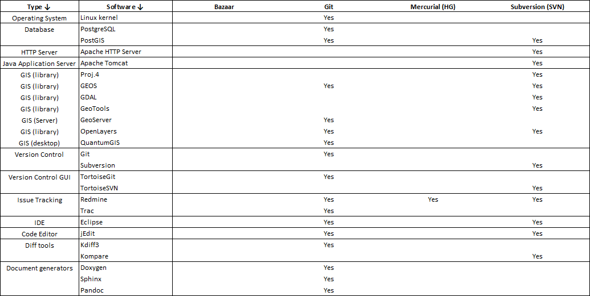

.. metadata-placeholder

:DC.Title:
	Selection of the Version Control System
:DC.Creator:
	Nery, Fernanda
:DC.Date:
	2013-05-20
:DC.Description:
   Information on the selection of the version control system.
   Based on previous R&D projects.
:DC.Language:
	en
:DC.Format:
	text/x-rst
:DC.Rights:

:DC.RightsHolder:
   Fernanda Néry 2009-2013 © CC BY-SA 3.0 http://creativecommons.org/licenses/by-sa/3.0/

.. _sw-vcs-ref:

Version Control System
**********************

Requirements
============

The selected version control system is Git_.

Sourcecode hosting sites,
such as Github_ or BitBucket_,
provide an easily deployable and inexpensive alternative to in-house hosting.

Rationale
=========

(See overview in :ref:`sw-technical-infrastructure-ref` )

`Version Control`_ or revision control
is the management of of changes to documents,
computer programs, large web sites, and other collections of information.
The set of files under version control is kept in a :term:`repository`.

The *Version Control System* (VCS) is the application responsible
for keeping track of the successive versions of a repository.

Without a repository under version control, project information
quickly gets scattered and duplicated over file systems and e-mail attachments,
rendering it inconsistent and unmanageable.
If coupled with clear operating procedures, a VCS can vastly simplify
the management of changes to project documentation and source code.

In this project, a version control is required:

*  to manage the technical documentation
   (requirements, analysis, design, code and API documentation);
*  to manage the source code of the different components;
*  to manage the end user documentation production and translation.

Additional requirements are:

*  The documentation and source code repository must be under the same VCS.
*  The documentation and source code repository should be integrated with the
   project management / issue tracking system.

Analysis of alternatives
========================

The following table contains a comparison of 4 version control products
compatible with the established :ref:`COTS selection constraints <sw-constraints-ref>`:

*  Bazaar_
*  Git_
*  Mercurial_
*  and Subversion_

|

.. _sw-vcs-table-ref:

.. image:: img/VersionControlSystems.png
   :width: 80%
   :alt: Comparison of version control software

.. topic:: Table legend

   .. list-table::
      :widths: 10 90 

      *  -  **Feature**
         -  **Description**
        
      *  -  Repository model
         -  In a client–server model, users access a master repository via a client; 
            typically, their local machines hold only a working copy of a project tree. 
            Changes in one working copy must be committed to the master repository 
            before they are propagated to other users. 
            In a distributed model, repositories act as peers, 
            and users typically have a local repository with version history available, 
            in addition to their working copies.
      *  -  Concurrency model
         -  Describes how changes to the working copies 
            are managed to prevent simultaneous edits from causing nonsensical data
            in the repository. In a lock model, changes are disallowed until the user 
            requests and receives an exclusive lock on the file from 
            the master repository. In a merge model, users may freely edit files, 
            but are informed of possible conflicts upon checking their changes into 
            the repository, whereupon the version control system may merge changes 
            on both sides, or let the user decide when conflicts arise. 
      *  -  Storage Method
         -  Describes the form in which files are stored in the repository. 
            A snapshot indicates that a committed file(s) 
            is stored in its entirety—usually compressed. 
            A changeset, in this context, indicates that a committed file(s) 
            is stored in the form of a difference between either the previous version or the next.
      *  -  Scope of change
         -  Describes whether changes are recorded 
            for individual files or for entire directory trees.
      *  -  Revision IDs
         -  Are used internally to identify specific versions 
            of files in the repository. 
            Systems may use pseudo-random identifiers, 
            content hashes of revisions, or filenames with sequential version numbers.
      *  -  Network protocols
         -  Lists the (secure) protocols used for synchronisation of changes.
      *  -  User interfaces
         -  Describes whether access to the repository is available 
            using an internet browser, through 3rd-party issue tracking systems, 
            or using command line (CLI) 
            and 3rd-party graphical user interfaces 
            (available for the Windows and Linux platforms)
      *  -  IDE integration
         -  Lists examples of tools that allow the integration of the VCS
            with two common integrated development environments (IDE):
            Eclipse_ and Microsoft `Visual Studio`_ 
      *  -  Atomic commits
         -  Refers to a guarantee that all changes are made, 
            or that no change at all will be made.
      *  -  Merge tracking
         -  Describes whether a system remembers 
            what changes have been merged between which branches 
            and only merges the changes that are missing when merging one branch into another.
      *  -  File renames
         -  Describes whether a system allows files 
            to be renamed while retaining their version history.
      *  -  Event hooks
         -  Indicates the capability to trigger commands 
            before or after an action, such as a commit, takes place.
      *  -  Signed revisions
         -  Refers to integrated digital signing of revisions, 
            in a format such as OpenPGP.
      *  -  End of line conversions
         -  Describes whether a system can adapt 
            the end of line characters for text files such that they match 
            the end of line style for the operating system under which it is used. 
      *  -  Unicode filename support
         -  Indicates if the software has support 
            for interoperation under file systems using different character encodings.        

   Source: `version control software comparison`_ (adapted)

.. rubric:: Evaluation

The major difference between the products is the centralised (Subversion_)
or distributed (Bazaar_, Git_, Mercurial_) nature of the repository.
Decentralised systems are relatively recent (after 2005),
but have gained wide acceptance,
as they allow a more flexible project organisation
(e.g. collaboration within smaller teams that contribute to a larger project)
and to not require that every user is connected to a single online repository
(on the internet or corporate intranet).
Decentralised systems can also support 'centralised-like' workflows,
simply by defining which is the canonical (authoritative) repository,
where the 'official' or approved versions are kept.

Feature-wise, a clear "winner" does not emerge from the evaluation:

*  Online hosting services exist for all the products
   (i.e. it is possible to store the repository on the web).

*  All systems support secure network protocols such as SSL or HTTPS
   (besides various proprietary protocols).

*  Various user interfaces are available: web interfaces
   (including integration with issue tracking systems such as Redmine or Trac),
   bash-like command line interfaces (CLI)
   and various native or 3rd-party graphical user interfaces (GUI).

*  For software development purposes, all version control systems
   can be coupled to integrated development environments (IDE), using plug-ins.
   Examples are listed for two common multilanguage IDEs:
   Eclipse_ and Microsoft `Visual Studio`_.

*  Major features are similar among products
   (though neither the commands nor the typical workflow are).

The final selection is made by evaluating software adoption in real-world
development projects.

Real-world use
==============

Basic information on developer community activity
is available through the following `Ohloh indicators on version control systems`_.

Software adoption is evaluated using a simple criterion:

-  Which is the version control system used
   by the different open-source COTS evaluated for this project?

.. _sw-vcs-adoption-table-ref:

A similar generic trend is clear in the
`results of the Eclipse Community Survey 2012 <http://www.eclipse.org/org/press-release/20120608_eclipsesurvey2012.php>`_.

.. rubric:: Conclusion

Based on the software adoption results,
Git_ is clearly the recommended version control system.

.. links-placeholder

.. include:: ../Z_SharedFiles/Z_GenericLinks.txt

