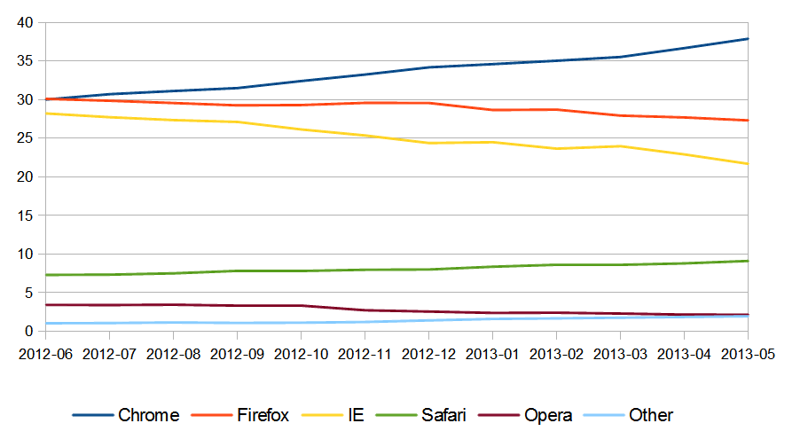
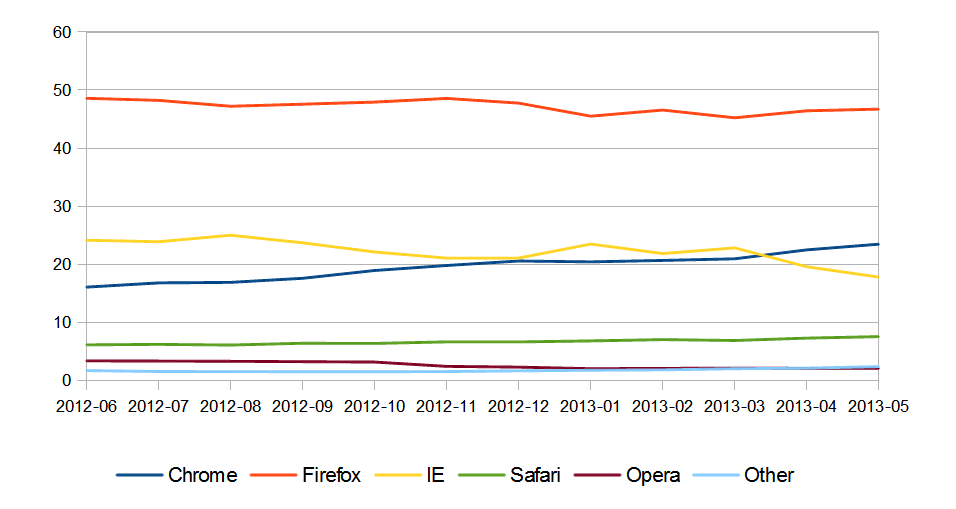
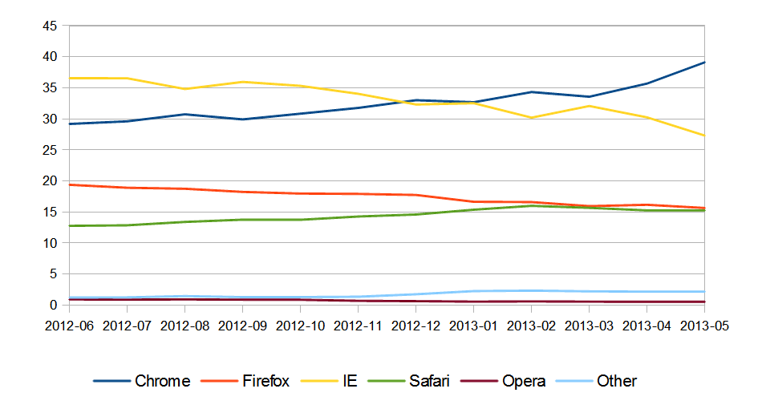
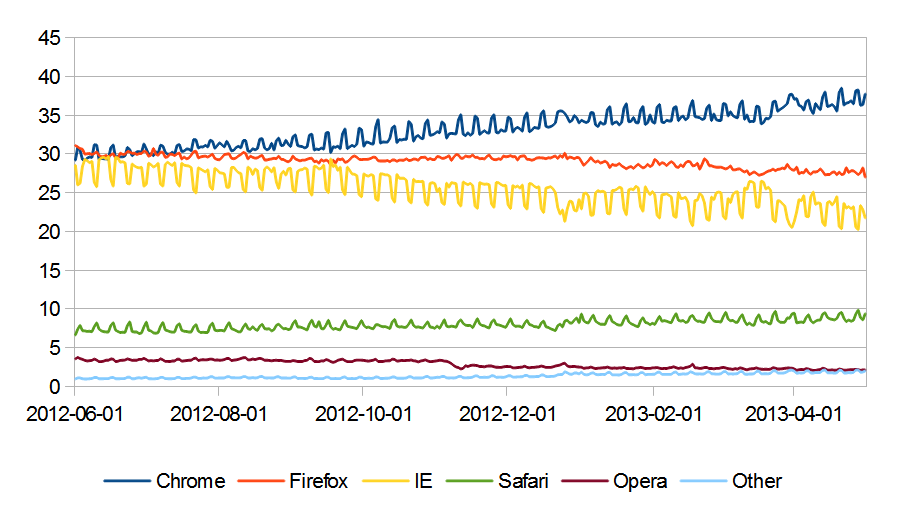
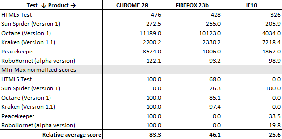

.. metadata-placeholder

:DC.Title:
	Selection of the Web Browser
	Nery, Fernanda
:DC.Date:
	2013-06-01
:DC.Description:
   Updated from previous R&D projects.
:DC.Language:
	en
:DC.Format:
	text/x-rst
:DC.Rights:

:DC.RightsHolder:
   Fernanda Néry 2009-2013 © CC BY-SA 3.0 http://creativecommons.org/licenses/by-sa/3.0/

.. _sw-webbrowser-ref:

Web Browser
***********

Requirements
============

Web User Interfaces (WUI) **must** tested/accepted in:

*  `Google Chrome`_ 28+
*  or `Mozilla Firefox`_ 22+.

Due to the specific requirements of the infrastruture provider for PT,
WUI **should** also be tested in:

*  `Internet Explorer`_ 8+

Rationale
=========

In this section, the objective is not to select a web browser, but to establish
which web browsers should any Web User Interfaces be tested and accepted in.

Two simple criteria are used in the selection process:

*  Browser usage statistics in Europe,
*  Feature support and performance

Analysis of alternatives
========================

.. rubric:: Usage share

Browser usage statistics produced by StatCounter_ allow the identification
of the products with the larger usage share in Europe.
Other sources of statistics on the `usage share of web browsers`_ are available,
but the relative ranking of the products is similar.

`Google Chrome`_ is currently the most used browser in Europe (since June 2012).
`Internet Explorer`_ relative usage share is declining as is, to a lesser extent,
`Mozilla Firefox`_\ 's.
However there are marked regional differences,
for example, in Europe's two most populous countries:

*  In Germany, Mozilla Firefox is the dominant browser (> 45%),
   and Google Chrome has only recently (April 2013) surpassed Internet Explorer;
*  In the United Kingdom, Google Chrome is the dominant browser with a share
   similar to Internet Explorer. Mozilla Firefox and Apple's Safari_ have
   similar usage quotas, around 15%.

Alternative version: :ref:`sw-web-browser-stats-dynamic-ref`)

.. _sw-browser-eu-monthly-ref:

   
   **Legend:** Top 5 browsers in Europe, June 2012 to May 2013, monthly average

.. _sw-browser-DE-monthly-ref:

   **Legend:** Top 5 browsers in Germany, June 2012 to May 2013, monthly average
   
.. _sw-browser-GB-monthly-ref:

   **Legend:** Top 5 browsers in the United Kingdom, June 2012 to May 2013, monthly average
   
.. _sw-browser-eu-daily-ref:

   **Legend:** Top 5 browsers in Europe, June 2012 to May 2013, daily values

.. rubric:: Relative benchmarking
   
The current versions of the 3 most common browsers (Chrome_, Firefox_ and IE_)
can be ranked using the average of their min-max normalised scores
on the following 'feature support'/'performance benchmark' tests:

   *  `HTML5 test`_
   *  SunSpider_ (Version 1)
   *  Octane_ (Version 1)
   *  Kraken_ (Version 1.1)
   *  Peacekeeper_
   *  RoboHornet_ (alpha version)

The tests focus on partially overlapping aspects of
HTML5_ and Javascript_ support, using different approaches
(feature support, laboratory tests directed towards specific features,
or performance tests that try to simulate real-world use situations).

The average test score provides a more resilient indicator
of each browser's capabilities,
regardless of the relative technical merits or applicability of a particular benchmark. [#browser-test]_

.. _sw-browser-test-scores-ref:

.. rubric:: Conclusions

Usage share statistics and test scores provide a consistent ranking:

#. `Google Chrome`_
#. `Mozilla Firefox`_
#. `Internet Explorer`_

Based on this ranking, the Google Chrome / Chromium_ is considered
the adequate browser for WUI development and testing.

An alternative option is to use Mozilla Firefox:
if the WUI works correctly in this browser, it will most likely work correctly
on Google Chrome.

These two browsers also comply with the defined :ref:`sw-constraints-ref`
and are supported in the selected :ref:`sw-operating-systems-ref`.

----

.. rubric:: Footnotes 

.. [#browser-test] Please note that the average relative score reflects 
   the comparison between the 3 products, not among all available browsers.
   Absolute test results 
   are dependent on hardware and configuration: 
   all tests were made on a Windows 7 (64-bit) machine, 
   running an Intel Core i5-2410M processor, 6GB RAM, 
   and an NVIDIA GeForce 540M graphics card. 
   Firefox 23 beta version was tested instead of the current production version 
   due a `(fixed) bug <https://bugzilla.mozilla.org/show_bug.cgi?id=855898>`__ 
   that affected Robohornet's descendant selector test in Firefox 22.
   

.. links-placeholder       

.. include:: ../Z_SharedFiles/Z_GenericLinks.txt

.. _support for Windows XP: http://windows.microsoft.com/en-us/windows/end-support-help
.. _ZDNet benchmark: http://www.zdnet.com/the-big-browser-benchmark-january-2013-edition-7000009776/ 