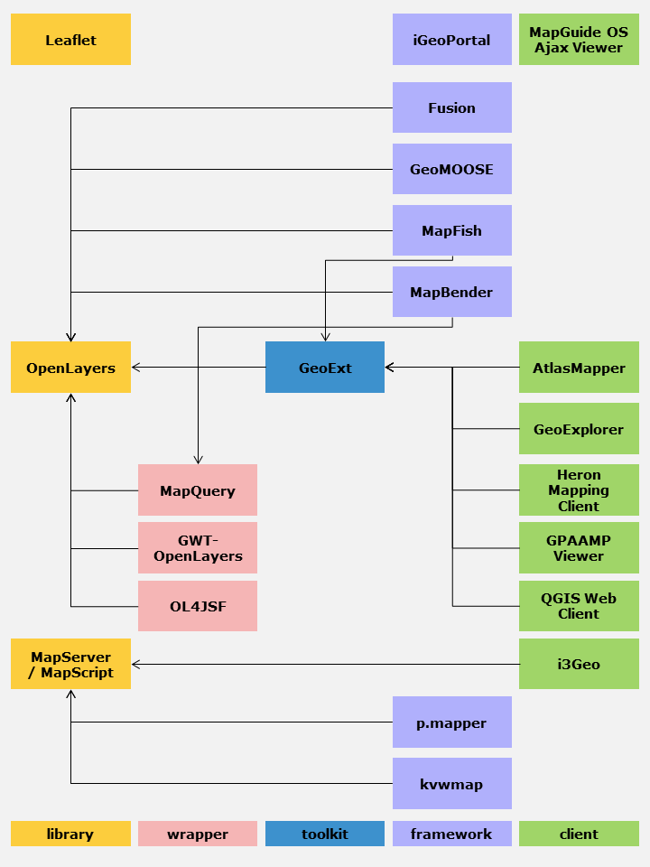
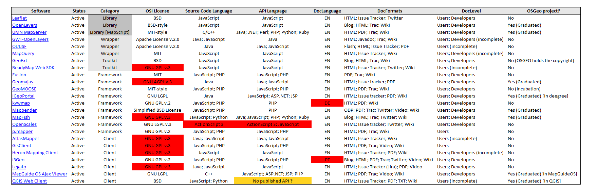

.. metadata-placeholder

:DC.Title:
	Selection of Web Mapping Components
:DC.Creator:
	Nery, Fernanda
:DC.Date:
	2013-05-01
:DC.Description:
   Information on the selection of web mapping components.
   Based on previous R&D projects.
   Updated.
:DC.Language:
	en
:DC.Format:
	text/x-rst
:DC.Rights:

:DC.RightsHolder:
   Fernanda Néry 2009-2013 © CC BY-SA 3.0 http://creativecommons.org/licenses/by-sa/3.0/

.. _sw-webmapping-ref:

Web Mapping
***********

Requirements
============

The selected web mapping library is OpenLayers_ 2.13+.

If required:

-  The web mapping solution can be supported by compatible toolkits,
   such as GeoExt_ 1.1+.
-  The web mapping solution can be based on the customisation of
   existing web map clients, such as GeoExplorer_.

Additional JavaScript_ libraries can be used if required,
subject to the global constraints on COTS selection.

Rationale
=========

The purpose of the web mapping component is to support
data visualisation (thematic mapping)
and geocoding (finding the geographic coordinates associated within geographical
names or administrative units).

The web mapping components must comply with the :ref:`sw-constraints-ref`
set on licence compatibility, portability and acquisition cost.

For thematic visualisation purposes,
the webmapping component must support the :ref:`OGC W*S protocols <sw-ogc-webservices-ref>`
previously identified.

For geocoding purposes,
the webmapping component must support access to the GeoNames_ service.

Analysis of alternatives
========================

The preliminary candidate set was based on an updated version of the
:ref:`sw-list-webmapping-tools-ref`.

The data was updated (last release, activity, licence type, etc.)
to provide the necessary information for the application
of the selection :ref:`sw-constraints-ref` on licence type, portability,
QSOS maturity criteria (e.g. exclusion of inactive or imature projects)
and open standards (e.g. exclusion of ActionScript_ components).

Integration criteria are subsequently applied:
e.g. exclusion of components that are essentially plug-ins for
specific platforms (e.g. Plone_) or that depend on components
otherwise unrequired (e.g. `PHP MapScript`_).

The analysis of alternatives was an update of German Carillo's
Web mapping client comparison v.6 [Carr12]_

The following diagram ilustrates the dependencies between
the various available alternatives identified in the candidate set.

.. rubric:: Dependencies between components

The majority of components are based on the GeoExt_ toolkit and
the OpenLayers_ library which currently the *de facto* standard
for web mapping applications.

In the following table a number of components is identified
that have EUPL incompatible licences,
or development/API language incompatible with the PT Open Standards regulation,
or technical documentation not available in English.

.. todo::

   Include updated table with the supported protocols.

.. rubric:: Examples

The following demos illustrate the use of OpenLayers_ for:

*  Geocoding or routing purposes

   -  OpenRouteService_
   -  Using the `GeoNames service`_ (or the ESRI Locator Service);
   -  Using the `OpenStreetMap Nominatim service`_
   -  Using the `an OpenLS service`_

*  Visualisation purposes

   -  `Map Compare`_ using different base map service providers (Google, Bing, OpenStreetMap, etc.).
   -  `Thematic mapping with OpenLayers`_
   -  `Interactive Heatmap`_ or `Heatmap Overlay`_

.. links-placeholder

.. include:: ../Z_SharedFiles/Z_GenericLinks.txt

.. _GeoNames service: http://projects.bryanmcbride.com/sandbox/OL_geocode.html
.. _OpenStreetMap Nominatim service: http://nominatim.openstreetmap.org/search?q=ADDRESS_HERE&format=XML/JSON/HTML
.. _an OpenLS service: http://openlayers.org/dev/examples/openls.html
.. _Map Compare: http://tools.geofabrik.de/mc/
.. _Thematic mapping with OpenLayers: http://thematicmapping.org/playground/
.. _Interactive Heatmap: http://blog.felipebarriga.cl/olheatmap_demo/
.. _Heatmap Overlay: http://www.patrick-wied.at/static/heatmapjs/demo/maps_heatmap_layer/openlayers.php

.. rubric:: References

.. [Carr12]  Carillo, G. (2012). Web mapping client comparison v.6. 03 January 2012. http://geotux.tuxfamily.org/index.php/en/geo-blogs/item/291-comparacion-clientes-web-v6
      
