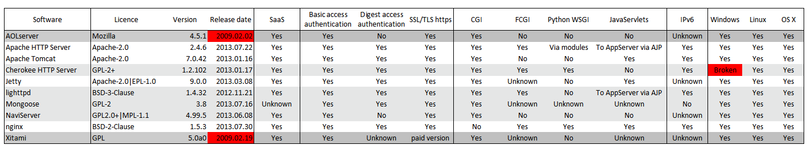
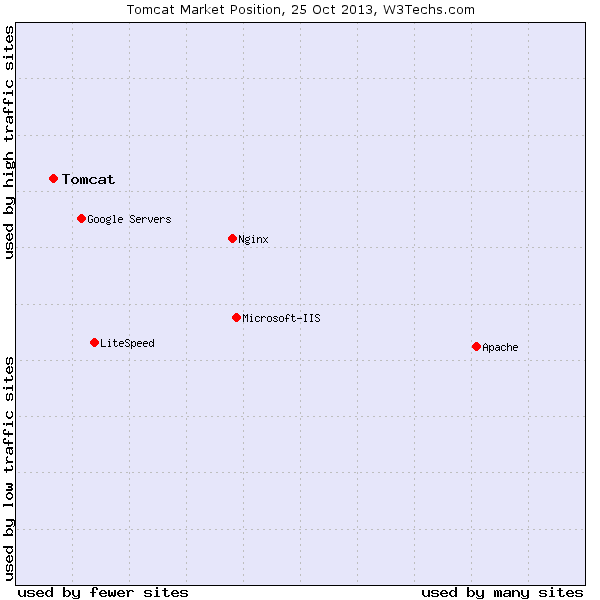

.. metadata-placeholder

:DC.Title:
   Selection of compatible HTTP servers
:DC.Creator:
   Nery, Fernanda
:DC.Date:
   2013-10-20
:DC.Description:
   Information on the selection of compatible HTTP servers.
   Based on previous R&D projects.
   Document created as per requirement of the infrastructure provider.
:DC.Language:
   en
:DC.Format:
   text/x-rst
:DC.Rights:

:DC.RightsHolder:
   Fernanda Néry 2013 © CC BY-SA 3.0 http://creativecommons.org/licenses/by-sa/3.0/

.. _sw-http-server-ref:

Web Server and Servlet COntainer
********************************

Requirements
============

The selected COTS are:

*  `Apache HTTP Server`_, as a web server
*  `Apache Tomcat`_, as a servlet container

Should a full J2EE application server be required,
the JBoss Application Server is an adequate alternative.

Rationale
*********

The web server will deliver static resources
(static pages, such as the documentation, JavaScript, CSS, images, etc.),
provide a security layer between the application server(s)
and the client applications (e.g. browsers),
allow for load balancing (if required)
and act as a reverse proxy
(routing incoming requests to specific application servers).

A web server is required by several of the other software components.
For example:

*  Trac_, the issue tracking system, is a Python application
   that requires a WSGI_, FastCGI_ or AJP_-capable web server
   (preferably WSGI), in production environments.

*  Geoserver_, the geospatial data server, is a Java application
   that requires a Java servet container application.

*  The map visualisation component
   is based on JavaScript_ libraries that support the web mapping applications.

*  Limesurvey_, is a PHP application for questionnaire management
   that can provide the required functionality for microdata collection.

*  phpPgAdmin is a PHP application that provides
   a web-based administration console for PostgreSQL
   (similar to phpMyAdmin for MySQL):
   although is not required, it is very useful for data management purposes.

*  Similarly, publication of the project documentation pages requires a web server,
   and the Sphinx, the documentation generator may also be deployed to such a server.

*  ... and so on.

In most cases, the final selection of the web server to be used
in a production environment will be made
by each organisation's ICT department or provider.
In the scope of this project,
the objective is to select an adequate option,
though not necessarily the one that a specific MS
may choose to use in its particular production environment.

In this perspective, the choice of web server is similar to
the choice of supported operating systems or supported web browsers:

*  it must be a common, well-known, stable,
   enterprise-strength and commercially supported COTS;

*  it must comply with the :ref:`sw-constraints-ref`
   set on licence compatibility, portability and acquisition cost;

*  it must be part of a reference platform
   on which the other COTS components (e.g. GeoServer, SDMX tools, etc.)
   have been tested on by each of their development teams.

*  and it must support the range of foreseeable project requirements.

Analysis of alternatives
************************

The following table presents an edited excerpt
of an existing `comparison of web server software`_,
from which all options non-compliant with the defined constraints
were excluded.

Some of the listed options are grayed out:

*  AOLServer and Xitami are no longer actively developed;
*  the Cherookee Windows built is broken in the last versions
   (i.e. there is no Windows version currrently available)
*  lighttp, NaviServer, or Mongoose have small development teams,
   and are dominated alternatives (as to maturity and adoption)
   when compared to Apache, nginx ot Jetty.

.. _sw-webserver-table-ref:

   
For the remaining competitors, the adoption statistics made available by
`w3techs.com <http://w3techs.com/technologies/overview/web_server/all>`__
and based on the top 10 million websites in the Alexa_ 3 month average ranking,
are as follows:

*  65.4% of sites use **Apache HTTP Server**;
*  14.5% of sites use **nginx** (rank #3)
*   0.4% of sites use **Apache Tomcat** (rank #6)
*   0.1% of sites use **Jetty** (rank #9)

The following image presents the average market position
of the three top FOSS options
(as well as the two most frequent proprietary options, Microsoft IIS and
LiteSpeed, and the unpublished custom Linux-based Web server
that Google uses for its online services).

.. _sw-webserver-market-ref:

.. rubric:: Conclusions

Apache HTTP Server is the dominant web server.
It can supports Python applications via **mod_wsgi**
(the Python WSGI adapter module for Apache), as well as CGI and FastCGI applications.

The Apache HTTP Server also supports AJP, the Apache JServ Protocol:
it can thus act as a reverse proxy
(routing the requests that reach the web server to a Java application server,
for example Apache Tomcat).

Given that a Java web container will be required
(by components such as GeoServer),
an alternative would simply be to use Apache Tomcat (or Jetty) as a web server.
However, globally, this solution is less flexible
and, during the project, a WSGI-compliant web server would still
be required for the project management infrastructure.

In conclusion, the use of Apache HTTP Server
plus Apache Tomcat as a Java web container
provides adequate and flexible deployment options.

Note that it is assume that only a Java web container will be required,
not a full Java EE Application Server.

Should such requirement exist, Apache TomEE
(that reuses Tomcat as its web container part) might be used.
Alternative solutions are GlassFish or JBoss (recently renamed as WildFly).

The available usage statistics [#survey_JEE_appserver]_ for JBoss or GlassFish
are based on survey data and eventual survey bias is not documented.
However, JBoss consistently appears with a larger usage share in the surveys,
for comparable functionality
(see for example the small `comparative of Tomcat, JBoss, GlassFish and Jetty`_,
published by the developers of JRebel).

JBoss incorporates a Tomcat 6.0 derivative (fork) as its web container,
and

.. rubric:: Footnotes

.. [#survey_JEE_appserver]
      See, for example: 
      http://plumbr.eu/blog/most-popular-application-servers, 
      http://zeroturnaround.com/rebellabs/java-ee-productivity-report-2011/#servers, 
      http://zeroturnaround.com/rebellabs/developer-productivity-report-2012-java-tools-tech-devs-and-data/4/. 
   
.. links-placeholder

.. include:: ../Z_SharedFiles/Z_GenericLinks.txt
   
.. _comparison of web server software: https://en.wikipedia.org/wiki/Comparison_of_web_server_software
.. _alexa: http://www.alexa.com/
.. _comparative of Tomcat, JBoss, GlassFish and Jetty: http://zeroturnaround.com/rebellabs/the-great-java-application-server-debate-with-tomcat-jboss-glassfish-jetty-and-liberty-profile/#!/
