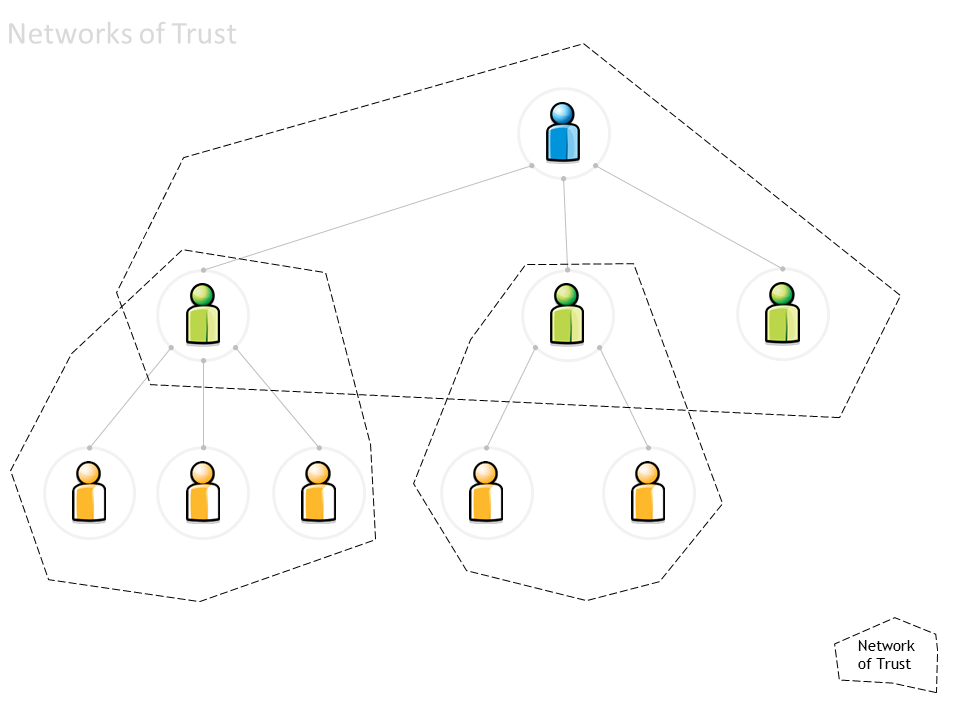
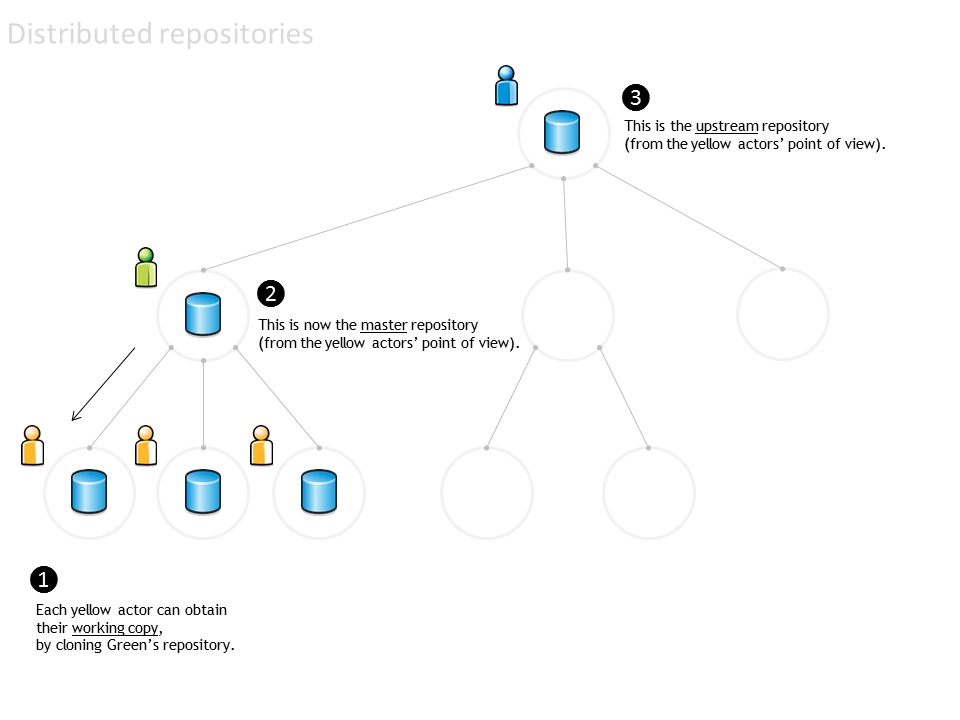
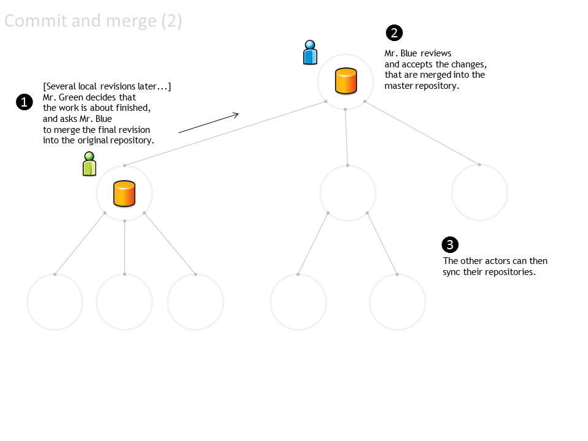
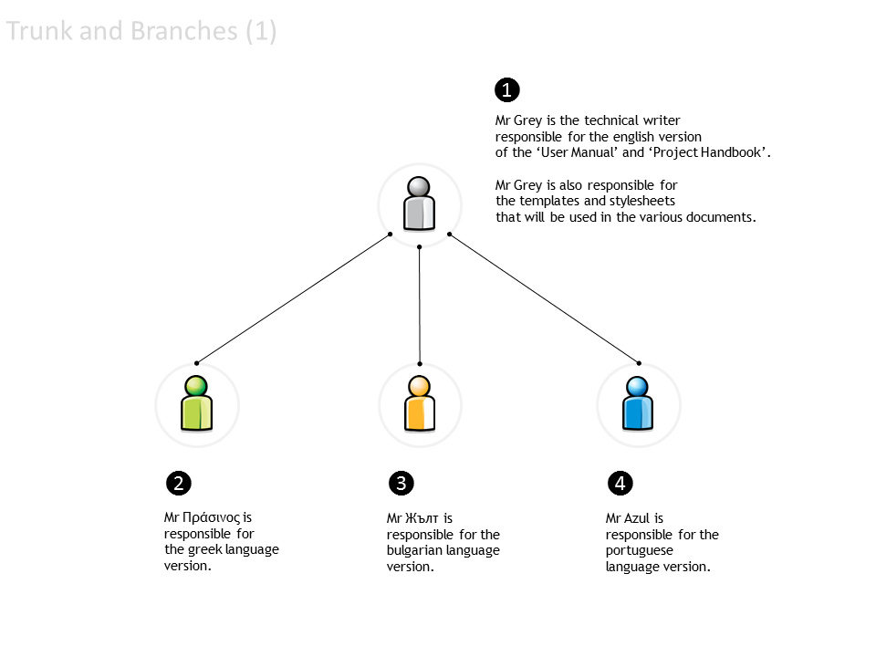
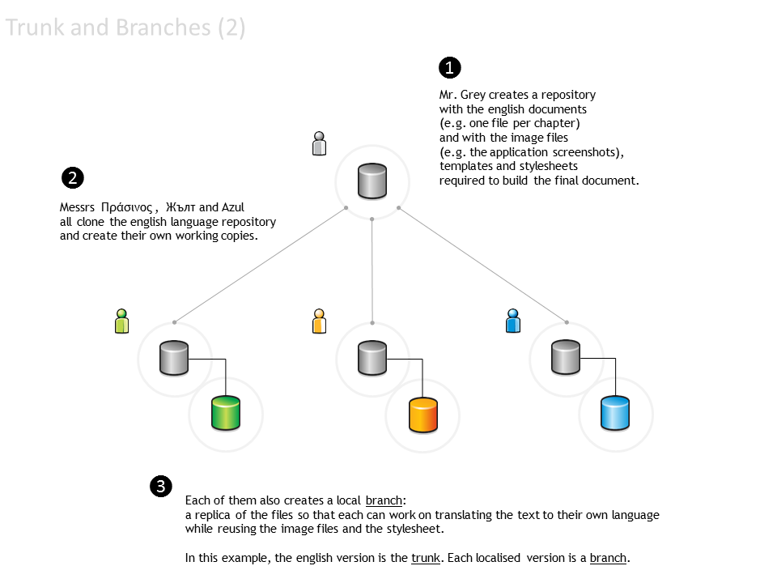
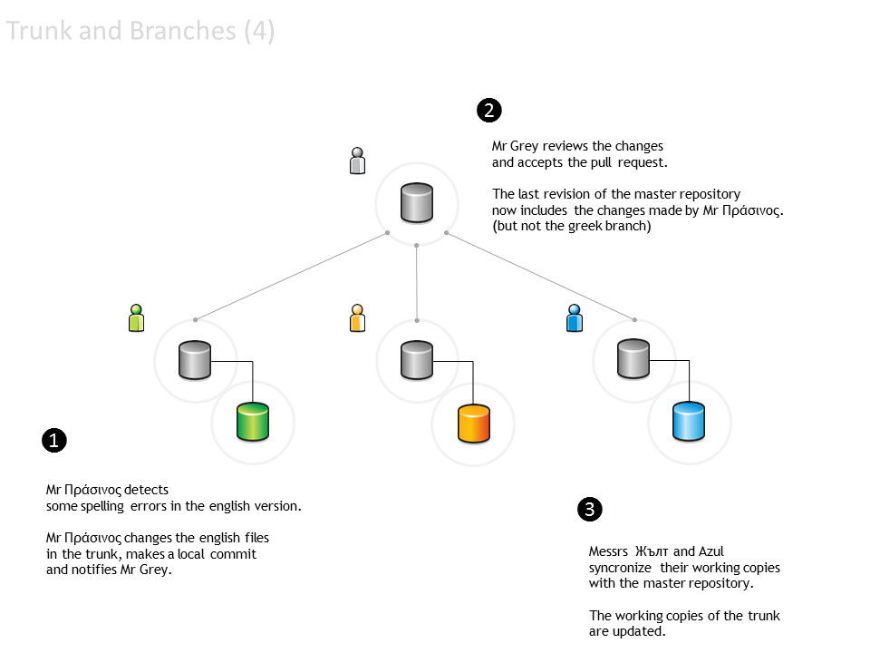

.. metadata-placeholder

:DC.Title:
	Background information on the use of Version Control
:DC.Creator:
	Nery, Fernanda
:DC.Date:
	2013-05-01
:DC.Description:
   Brief introduction to Version Control concepts and syntax.
:DC.Language:
	en
:DC.Format:
	text/x-rst
:DC.Rights:
	Public.

On Version Control
******************

Introduction
============

`Version Control`_ is the management of of changes to documents,
computer programs, large web sites, and other collections of information.
The set of files under version control is kept in a :term:`repository`.

The **Version Control System** (VCS) is the application responsible
for keeping track of the successive versions of a repository.

The basic workflow is:

#. A user clones the repository and creates a local :term:`working copy`
   of the files.
   (The local copy can itself be a local repository under version control).

#. The user works on the local copy of the files.
   (Note that not every change to every file is registered as a :term:`revision`).

#. When the user wants to
   (e.g. when a new version of a document is quite complete, or every day at 6:14pm ...),
   a group of new or modified files (or :term:`changeset`)
   can be committed as a revision to the local working copy.

#. The user can also choose when to :term:`commit`
   the revisions back into the original repository.

#. If the local revisions are merged into the original repository,
   a new revision point is created therein.

   The :term:`merge` can be performed automatically by the version control system:

   a. if the user has the required permissions
      to commit (``push``) to the original repository;

   #. and if no :term:`conflict` is detected
      (e.g. while the user was working in the local copy,
      someone else committed a revision to same files).

#. If the user does not have the required permissions
   to commit to the original repository,
   a ``pull`` request can be sent to the owner of the repository.

   The owner reviews the proposed changes, and accepts or rejects the changeset.

The following storyboard illustrates this steps.

Storyboard #1 - The basic workflow
==================================

This storyboard depicts a simplified workflow, using a simplified hierarchy.
(In real-world use, links can exist between any two different actors and repositories.
The technology allows networks with arbitrary configuration.)

Network of actors
-----------------

Consider a typical hierarchy:

.. figure:: img/01-NetworkOfActors.png
   :alt: Network of actors
   :width: 80%

*  The ‘blue’ actor only works and knows the ‘green’ actors.

*  Each ‘green’ actor works with a distinct group of ‘yellow’ actors.

*  The blue actor’s responsibility is to collate the green actors’ contributions (changes)
   and to resolve any conflicts between different changes proposed by distinct green actors.

*  Each green actor’s responsibility is similar, with regard to the yellow actors.

Networks of trust
-----------------

This hierarchy is a particular type of network (...a directed acyclic network or ‘tree’).

It can be viewed as 3 distinct “networks of trust”.

The concept of “network of trust” simplifies the work:

*  The blue actor trusts the green actor to review the work done by his yellow co-workers.

   *  From the blue actor’s point of view,
      the specific configuration of each ‘green & yellow’ network is irrelevant.

   *  It is also irrelevant whether the all network is really a tree
      (or if a given yellow actor participates in two distinct subnetworks).

*  Each actor needs only trust (and interact with) his immediate neighbourhood:

   *  The green actor accepts any upstream changes approved by his blue neighbour.
   *  The green actor approves (or declines) changes made by his yellow neighbours
      (or resolves conflicts between different changes).

*  By definition, the blue actor can directly commit changes
   to his own blue repository of information.
   So can the green actors to their own green repositories.

*  Each actor can also ‘pull’ into his repository
   any changes that his immediate neighbours have made.

Cloning a repository
--------------------

The initial workflow is depicted below:

1. Mr Blue creates the **original** repository.

2. Mr Green **clones** Blue's repository

3. thus obtaining a **working** copy.

.. figure:: img/03-CloningARepository.png
   :alt: Cloning a repository
   :width: 80%

Distributed repositories
------------------------

The repository is then distributed to all the team:

1. Each yellow actor can obtain their working copy, by cloning Green’s repository.

2. Mr Green's repository is now the **master** repository for all the yellow actors.

3. Mr Blue's repository is now the **upstream** repository for all the yellow actors.

Synchronising repositories
--------------------------

The repositories must be explicitly synced. For example, suppose that:

1. Mr Green changed some files and then made a ‘local commit’.
   Green’s repository now has a new revision (which does not exist in any other repository).

2. One of the yellow actors synchronises the local working copy everyday,
   to ensure that he has the latest files.
   His local working copy is updated with the latest revision made
   by Mr Green to the master repository.

3. The other yellow actors didn’t update their local working copies,
   and still have the previous revision.

4. Meanwhile, Mr Blue is unaware of any changes in the downstream repositories.

.. figure:: img/05-SynchronisingRepositories.png
   :alt: Synchronising repositories
   :width: 80%

Commit and merge
----------------

Changes can also by propagated upstream. Suppose that:

1. A yellow actor has changed some files and made a ‘local commit’.
   The local repository has a new revision
   (jargon: 'the local repository is one commit ahead of the master repository').

2. The yellow actor notifies Mr Green and asks him to merge the changeset
   into Mr Green's repository (jargon: 'sends Mr Green a pull request').

3. Mr Green reviews the changes, approves them (or not...) and merges
   the changeset into his own repository.

4. Meanwhile, Mr Blue is still unaware of any changes in the downstream repositories
   (he has received no pull requests).

.. figure:: img/06-CommitAndMerge1.png
   :alt: Commit and merge   
   :width: 80%

When the work assigned to Mr Green's team is ready:

1. Mr Green send a 'pull request' to Mr Blue.

2. Mr. Blue reviews and accepts the changes, and updates his repository.

3. Everyone else can synchronise their repositories to the latest version.

Storyboard #2 - Using branches to manage the document translation process
=========================================================================

Trunk and branches
------------------

Consider the following network:

*  Mr Grey is the technical writer responsible for the English version of the ‘User Manual’ and ‘Project Handbook’.
   Mr Grey is also responsible for the templates and stylesheets that will be used in the various documents.

*  Mr Πράσινος is responsible for the Greek language version.

*  Mr Жълт is responsible for the Bulgarian language version.

*  Mr Azul is responsible for the Portuguese language version.

When the translation process begins:

1. Mr Grey creates a repository
   with the English documents
   (e.g. one file per chapter)
   and with the image files
   (e.g. the application screenshots),
   templates and stylesheets
   required to build the final document.

2. Messrs  Πράσινος,  Жълт and Azul
   all clone the English language repository
   and create their own working copies.

3. Each of them also creates a local branch:
   a replica of the files so that each can work on translating the text to their own language
   while reusing the image files and the stylesheet.

   In this example, the English version is the **trunk**.
   Each localised version is a **branch**.

When new documents are ready to be translated:

1. Mr Grey completes a new chapter
   and commits it to the repository.

   Mr Grey also changes some of the images.

   A new revision is now available.

2. Messrs  Πράσινος,  Жълт and Azul synchronise  their working copies
   with the master repository
   (only the trunk is updated).

3. Each of them also updates the local branch.

.. figure:: img/10-TrunkAndBranches3.png
   :alt: Trunk and branches
   :width: 80%

What if Mr Πράσινος detects some spelling errors in the English version?

1. Mr Πράσινος changes the English files
   in the trunk, makes a local commit
   and notifies Mr Grey.

2. Mr Grey reviews the changes
   and accepts the pull request.

   The last revision of the master repository
   now includes the changes made by Mr Πράσινος
   (but not the Greek branch).

3. Messrs  Жълт and Azul
   synchronise  their working copies
   with the master repository.

   The working copies of the trunk are updated.
   Each team member must update their specific local branches.

Branches can function as different versions...

1. Mr Πράσινος changes
   the default stylesheet,
   including some styles that improve its use with the Greek alphabet.

   Changes are made only
   in the Greek language branch.

2. Mr Жълт makes a similar
   change, due to the Cyrillic alphabet.

   Changes are made only
   to the Bulgarian language branch.

3. Mr Azul dislikes the colour of chapter headings and changes the stylesheet
   in the Portuguese language branch.

   Mr Azul decides to submit the changes to Mr Grey,
   so that the trunk can also be changed.

4. Mr Grey reviews the changes made by Mr Azul,
   but does not accept them.

   The trunk stylesheet is not changed.

.. figure:: img/12-TrunkAndBranches5.png
   :alt: Trunk and branches
   :width: 80%
  
   
Glossary
========

.. glossary::
   :sorted:
   
   baseline 
       An approved revision of a file from which subsequent changes can be made. 

   branch 
       A set of files under version control may be branched (forked) at a point 
       in time. From that time forward, the two copies of the files may develop 
       in different ways, independently of each other.

   change 
       A change (or diff, or delta) represents a specific modification to a 
       file under version control.

   changeset
       A collection of files that have changes.

   checkout 
       See 'clone'.

   clone
       To clone is to create a local working copy from the repository. 
       A user may specify a revision or obtain the latest. 
       In centralised version control systems (with a single central repository),
       the term 'checkout' is also used.
       The term 'checkout' can be used as a noun to describe the working copy.

   commit 
       To commit is to write or merge the changes made in the working copy back 
       to the repository. The terms 'commit' and 'checkin' can also be used as 
       nouns to describe the revision that is created as a result of committing.

   conflict 
       A conflict occurs when different parties make changes to the same file, 
       and the system is unable to reconcile the changes. 
       
       A user must resolve the conflict by combining the changes, 
       or by selecting one change in favour of the other.

   fork
       See 'branch'.

   head
       The most recent revision, either to the trunk or to a branch.
       
       The trunk and each branch have their own head. 
       HEAD is sometimes used to refer to the head of the trunk.

   merge 
       A merge is an operation in which two sets of changes are applied 
       to a file or set of files under version control. 
       
       A user updates their working copy with changes made to the repository
       by other users.
       
       A user tries to update a repository with changes made to a working copy.

   repository 
       The repository is where the files' current and historical data are stored,
       often on a server.

   resolve 
       The act of user intervention to address a conflict between different 
       changes to the same file.

   revision 
       A revision (version) is any registered "snapshot" in time of the repository.

   sync
       See 'update'.

   trunk
       The trunk is the "main" line of development to the collection of 
       information under version control, consisting only of 'baseline' (approved) 
       files.

   update 
       An update (or sync) merges changes made in the original repository 
       (by other users, for example) into the local working copy.
     
   version
       See 'revision'.

   working copy
       A working copy is a local copy of files from a repository, made
       at a specific time (revision).
    

.. links-placeholder

.. include:: ../Z_SharedFiles/Z_GenericLinks.txt

.. _`Version Control`: http://en.wikipedia.org/wiki/Revision_control

