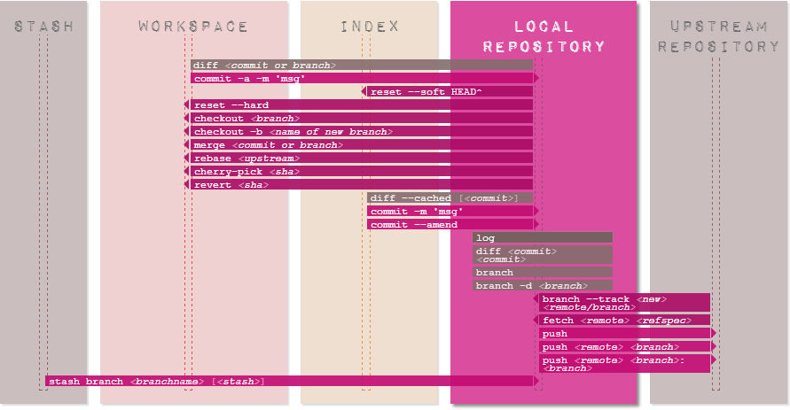

.. metadata-placeholder

:DC.Title:  Version Control using Git
:DC.Creator: Nery, Fernanda
:DC.Date:   2013-05-01
:DC.Description: Brief introduction to version control using Git.
   Mostly based on:
   - Git documentation
   - https://na1.salesforce.com/help/doc/en/salesforce_git_developer_cheatsheet.pdf (c) 2011, salesforce.com, inc
   - http://ndpsoftware.com/git-cheatsheet.html (c) 2009-2012, Andrew Peterson
:DC.Language:  en
:DC.Format: text/x-rst
:DC.Rights: Public access.

Version Control using Git
*************************

Before you start
================

The following resources contain useful information on version control systems:

* `A Visual Guide to Version Control`_:
   a simple explanation of version control with Subversion examples.
* `A successful Git branching model`_: a clear and structured workflow.

Git CheatSheet
==============

.. admonition:: Source
   
   Git CheatSheet,(c) 2011, salesforce.com, inc.,  
   URL: https://na1.salesforce.com/help/doc/en/salesforce_git_developer_cheatsheet.pdf 
   

Overview
--------

When you first setup Git, set up your user name and email address so your first
commits will record them properly::

   git config --global user.name "My Name"
   git config --global user.email "user@email.com"   
 
Basic Git Workflow Example
--------------------------

Initialise a new git repository,
then stage all the files in the directory
and finally commit the initial snapshot::

   $ git init
   $ git add .
   $ git commit -m 'initial commit'

Create a new branch named feature_A,
check it out so it is the active branch,
then edit and stage some files
and finally commit the new snapshot::

   $ git branch feature_A
   $ git checkout feature_A
   $ (edit files)
   $ git add (files)
   $ git commit -m 'add feature A'

Switch back to the master branch,
reverting the feature_A changes you just made,
then edit some files
and commit your new changes directly in the master branch context.::

   $ git checkout master
   $ (edit files)
   $ git commit -a -m 'change files'

Merge the feature_A changes into the master branch context,
combining all your work.
Finally delete the feature_A branch.::
   
   $ git merge feature_A
   $ git branch -d feature_A   

Setup & Init
------------

Git configuration, and repository initialisation & cloning.

   =================================== =====================================================
   command                             description
   =================================== =====================================================
   ``git config [key] [value]``        set a config value in this repository
   ``git config global [key] [value]`` set a config value globally for this user
   ``git init``                        initialise an existing directory as a Git repository
   ``git clone [url]``                 clone a Git repository from a URL
   ``git help [command]``              get help on any Git command
   =================================== =====================================================

Stage & Snapshot
----------------

Working with snapshots and the Git staging area.

   ======================= =====================================================================================================
   command                 description
   ======================= =====================================================================================================
   ``git status``          show the status of what is staged for your next commit and what is modified in your working directory
   ``git add [file]``      add a file as it looks now to your next commit (stage)
   ``git reset [file]``    reset the staging area for a file so the change is not in your next commit (unstage)
   ``git diff``            diff of what is changed but not staged
   ``git diff --staged``   diff of what is staged but not yet committed
   ``git commit``          commit your staged content as a new commit snapshot
   ``git rm [file]``       remove a file from your working directory and unstage
   ======================= =====================================================================================================

Branch & Merge
--------------

Working with Git branches and with the stash.

   ============================= =====================================================================================================
   command                       description
   ============================= =====================================================================================================
   ``git branch``                list your branches. a * will appear next to the currently active branch
   ``git branch [branch-name]``  create a new branch at the current commit
   ``git checkout [branch]``     switch to another branch and check it out into your working directory
   ``git checkout -b [branch]``  create a branch and immediately switch to it
   ``git merge [branch]``        merge another branch into your currently active one and record the merge as a commit
   ``git log``                   show commit logs
   ``git stash``                 stash away the currently uncommitted modifications in your working directory temporarily
   ``git stash apply``           re-apply the last stashed changes
   ============================= =====================================================================================================

Share & Update
--------------

Fetching, merging and working with updates from another repository.

   ================================ =====================================================================================================
   command                          description
   ================================ =====================================================================================================
   ``git remote add [alias] [url]`` add a git URL as an alias
   ``git fetch [alias]``            fetch down all the branches from that Git remote
   ``git merge [alias]/[branch]``   merge a branch on the server into your currently active branch to bring it up to date
   ``git push [alias] [branch]``    push the work on your branch to update that branch on the remote git repository
   ``git pull``                     fetch from the URL tracked by the current branch and immediately try to merge in the tracked branch
   ================================ =====================================================================================================

Inspect & Compare
-----------------

Examining logs, diffs and object information.

   ================================ =====================================================================================================
   command                          description
   ================================ =====================================================================================================
   ``git log``                      show the commit history for the currently active branch
   ``git log branchB..branchA``     show the commits on branchA that are not on branchB
   ``git log --follow [file]``      show the commits that changed file, even across renames
   ``git diff branchB...branchA``   show the diff of what is in branchA that is not in branchB
   ``git show [SHA]``               show any object in Git in human-readable format
   ================================ =====================================================================================================

Contributing on GitHub
----------------------

To contribute to a project that is hosted on GitHub
(or another repository hosting site, such as BitBucket)
you can fork the project online,
then clone your fork locally,
make a change, push back to GitHub
and then send a pull request, which will email the maintainer.::

   fork project on github
   $ git clone https://github.com/my-user/project
   $ cd project
   $ (edit files)
   $ git add (files)
   $ git commit -m 'Explain what I changed'
   $ git push origin master
   go to github and click ‘pull request’ button

Visual Git Cheatsheet
=====================

.. admonition:: Source
   
   Git Cheatsheet, (c) 2009-2012, Andrew Peterson
   url: http://ndpsoftware.com/git-cheatsheet.html 
   
   A list of Git commands, categorized on what they affect.
  
   The interactive online version provides
   a description for each of the commands.

Stash
-----

A place to hide modifications made to the workspace,
while working on something else.
(The stash area is not required in a "normal" workflow.)

.. image:: img/Git-Cheatsheet_Stash.png
   :alt: Git commands that affect the stash
   :width: 80%
   
Workspace
---------

The local working area.

.. image:: img/Git-Cheatsheet_Workspace.png
   :alt: Git commands that affect the workspace
   :width: 80%

Staging area
------------

The "index"-- or "staging area" --
holds a snapshot of the content of the working area,
and it is this snapshot that is taken as the contents of the next commit.

.. image:: img/Git-Cheatsheet_Staging.png
   :alt: commands that affect the staging area
   :width: 80%

Local repository
----------------

A local area under version control.
Typical branches: master, dev (for local development), feature_x, bugfix_y

Upstream repository
-------------------

Typically a remote area under version control.
Default name is 'origin'. Typical branches here: master, shared_feature_x, release_y.

.. image:: img/Git-Cheatsheet_UpstreamRepo.png
   :alt: commands that affect the upstream repository
   :width: 80%

   
How to...
=========

This section include miscellaneous Git commands to perform different operations.

Set up a merge tool to resolve conflicts
----------------------------------------

Configure kdiff3 as the merge tool (in Windows)::

   $ git config --global mergetool.kdiff3.path 'C:\Program Files (x86)\KDiff3\kdiff3.exe'
   $ git config --global merge.tool kdiff3
      
Invoke kdiff3::
   
   $  git mergetool <file>
   
Force an update from the upstream repository
--------------------------------------------

This operation will discard all changes in the local repository::

   $ git reset --hard HEAD
   $ git pull

Add untracked files to the set of files under version control
-------------------------------------------------------------

A pattern can be used. For example, this will add any new or untracked ``*.rst`` file::

   $ git add $(git ls-files --other *.rst)

Remove multiple files from the set of files under version control
-----------------------------------------------------------------

This will remove multiple files that have already been deleted from disk::

   $ git rm $(git ls-files --deleted)

Alternatively, edit the ``.git\config`` file, and add the following lines::

   [alias]
      rma = !git ls-files --deleted -z | xargs -0 git rm

Then run the command using the alias::

   $git rma
   
Disable quoted file names
-------------------------

Special character and spaces in file names can be problematic.
To disable quotes file names (Windows Unicode Support), use::

   $  git config [--global] core.quotepath off

.. links placeholder

.. _`A successful Git branching model`: http://nvie.com/posts/a-successful-git-branching-model/
.. _`A Visual Guide to Version Control`: http://betterexplained.com/articles/a-visual-guide-to-version-control/