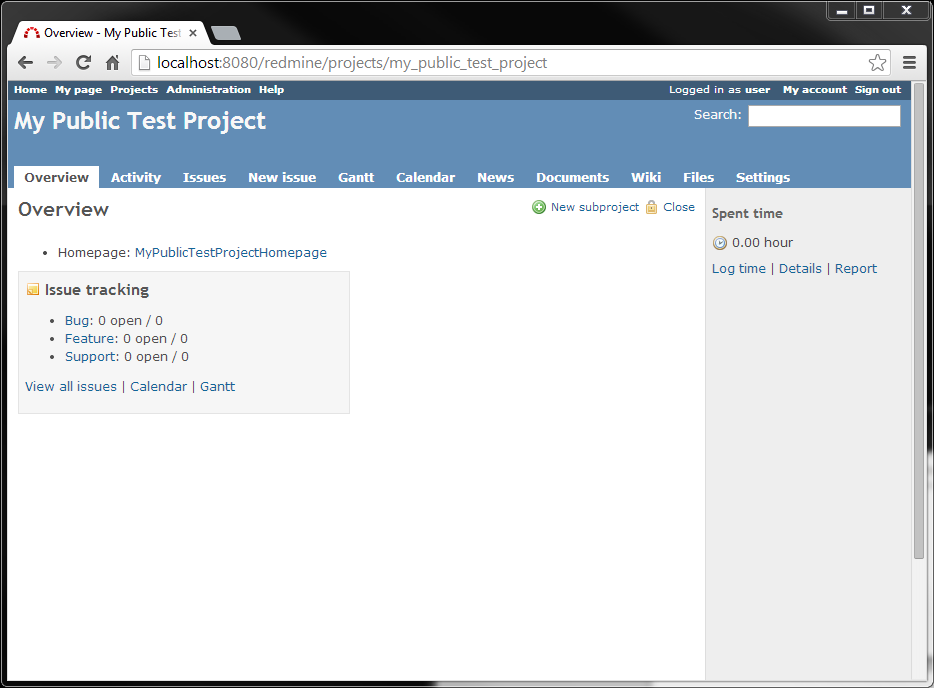

Redmine basic concepts
######################

.. note::

   http://www.cs.usask.ca/~spiteri/CMPT898/notes/redmine.pdf

Project space
*************

Redmine creates a separate space for each project.
This space describes the state of the project, e.g., the
number of bugs known to exist in the code.
The space also provides access to tools to help manage
the project, e.g., access to the project's wiki.

Issues
******
Redmine uses the word issue to refer to a development task.

There are several categories of issues:

*  Feature: This could be an aspect of the software package that is being developed.
*  Bug: This could be a part of the software package  that is not working as designed.
*  Support: This could be for helping individuals use the software package.

The site administrator can create new issue categories to customise the fit for a given project.

Roles
*****

Redmine users are issued roles to determine what they are allowed to do.

Roles are ordered below according to the number of privileges assigned to each role.
In general, a given role can do anything a lower-level role can plus some additional tasks.

1. Site administrator:

   *  Manage the Redmine site and the user accounts.
   *  Adjust permissions for roles.

2. Project manager:

   *  Can create space for new projects.
   *  Manage a project space, e.g., manage project members and their roles.
   *  Manage the documents for the project, e.g., upload and delete documents.
   *  Manage the wiki and forums.

3. Developer:

   *  Manage and edit issues.
   *  Edit the wiki.
   *  Manage files for the project, e.g., upload and delete files.
   *  Commit changes to the repository.
   *  Make changes to the repository.

4. Reporter:

   *  Create and view issues.
   *  Log time spent on issues.
   *  Browse repository.
   *  View the wiki.
   *  Participate in forum discussions.

How to map these concepts to the requirements of the MoSy project
*****************************************************************

The MoSy project will require:

*  A public project space conveying generic information about
   the project goals, partners, etc., plus whatever information
   can be made publicly available in the internet.

.. list-table:: Possible user-role allocation
   :header-rows: 1
     
   *  -  Role
      -  User
   *  -  Project manager
      -  Rita    
   
   
*  A reserved project space, used for the management of interactions
   between the projects partners:
   e.g. requests for comments on technical documents,
   dissemination of review documents
   (e.g. state-of-play, personal data protection regimes, institutional workflows, etc.)

*  A reserved project

.. include:: ../Z_SharedFiles/Z_GenericLinks.txt